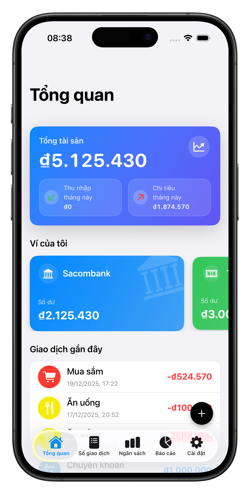
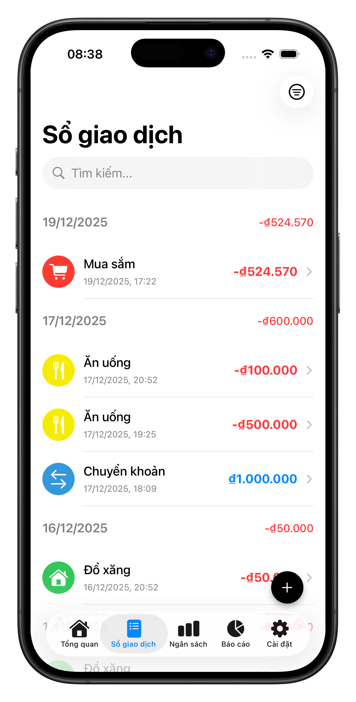
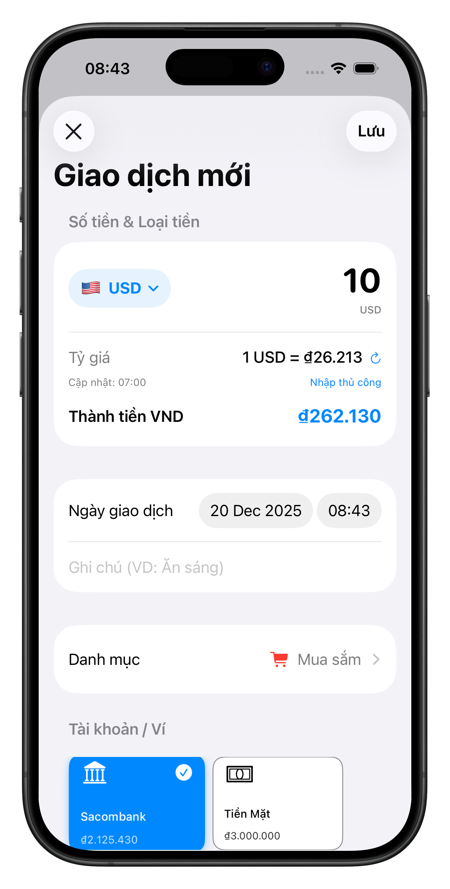
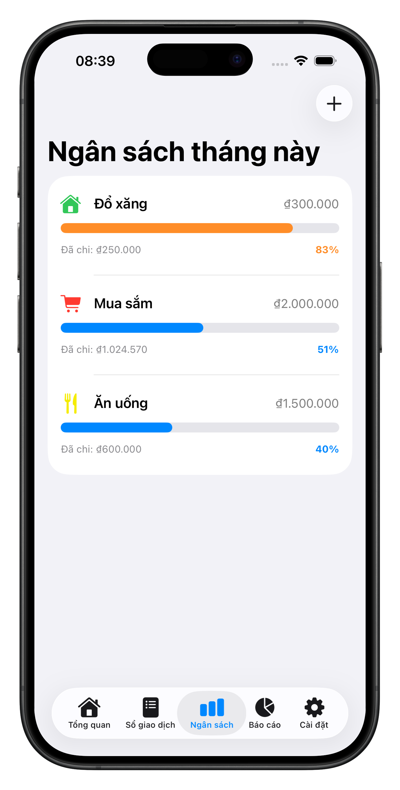
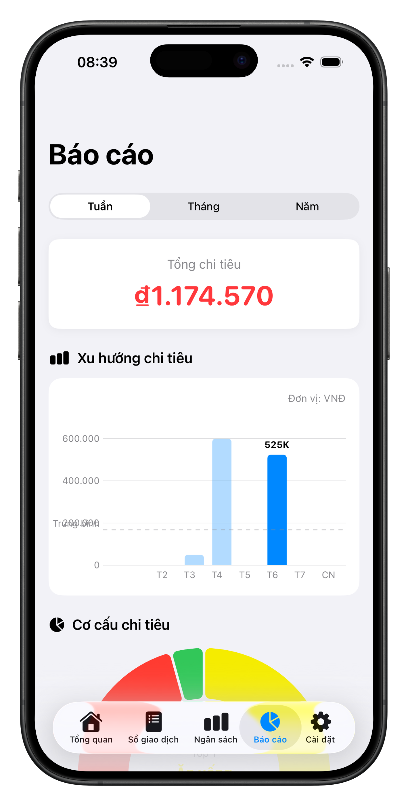

# Expenses Tracking 💰


**Expenses Tracking** is a modern iOS application designed to help users manage their personal finances effectively. Built entirely from scratch using **SwiftUI** and **SwiftData**, this project demonstrates clean architecture, solid engineering principles, and the use of the latest Apple frameworks.

## 📱 Features

* **Dashboard Overview**: Real-time summary of total assets, monthly income/expenses, and recent transactions.
* **Transaction Management**: Add, edit, and delete transactions with support for Income, Expense, and Transfer types.
* **Smart Budgeting**: Set monthly spending limits per category with visual progress tracking and over-budget alerts.
* **Financial Reports**: Visualize spending habits using interactive **Swift Charts** (Bar Charts & Donut Charts) with time filters (Week/Month/Year).
* **Multi-Currency Support**: Real-time currency conversion using `URLSession` and caching strategies.
* **Data Management**: Manage multiple wallets, custom categories, and **Export data to CSV** for external analysis.
* **Local Notifications**: Daily reminders to encourage habit-forming tracking.

## 🎥 Video Demo

[](https://www.youtube.com/watch?v=wlmgKt66D-8)

## 📸 Screenshots

<table width="100%">
  <tr>
    <td width="20%" align="center"><strong>Dashboard</strong></td>
    <td width="20%" align="center"><strong>Transactions</strong></td>
    <td width="20%" align="center"><strong>Add Transaction</strong></td>
    <td width="20%" align="center"><strong>Budgeting</strong></td>
    <td width="20%" align="center"><strong>Reports</strong></td>
  </tr>
  <tr>
    <td align="center">
      
    </td>
    <td align="center">
      
    </td>
    <td align="center">
      
    </td>
    <td align="center">
      
    </td>
    <td align="center">
      
    </td>
  </tr>
</table>

## 🛠 Tech Stack

* **Language**: Swift 6.2+
* **UI Framework**: SwiftUI
* **Data Persistence**: SwiftData 
* **Architecture**: MVVM (Model-View-ViewModel) with `@Observable` (Observation Framework)
* **Concurrency**: Swift Async/Await.
* **Networking**: URLSession 
* **Charts**: Swift Charts
* **Testing**: XCTest (Unit Tests & Mocking)

## 📂 Architecture 

The app follows a pragmatic **MVVM** architecture tailored for SwiftUI and SwiftData:

* **Models**: Defined using the `@Model` macro (`Transaction`, `Category`, `Wallet`, `Budget`).
* **Views**: Utilize `@Query` for efficient, reactive data fetching directly from the local database.
* **ViewModels**: Handle complex business logic (e.g., `ReportViewModel` aggregates data for charts, `CurrencyViewModel` manages API states).
* **Services**: 
    * `TransactionManager`: Centralized logic for handling transaction side-effects (e.g., updating wallet balances automatically).
    * `CurrencyService`: Handles API calls with an offline-first caching strategy (UserDefaults) to minimize network usage.
* **Dependency Injection**: Services are injected to facilitate Unit Testing (e.g. `MockURLProtocol`).

## 🚀 Getting Started

### Prerequisites

* Xcode 26.0 or later.
* iOS 26.0+ Simulator or Device.

### Installation

1.  **Clone the repository:**
    ```bash
    git clone https://github.com/danghoang03/Expenses-Tracking.git
    cd Expenses-Tracking
    ```

2.  **API Key Configuration (Important):**
    This project uses [ExchangeRate-API](https://www.exchangerate-api.com/) for currency conversion.
    - Get a free API key from their website.
    - Add it to your `Info.plist` with the key `EXCHANGE_RATE_API_KEY`.
    - Alternatively, you can set it as an environment variable in your Xcode scheme.
    - *For quick testing:* You can temporarily hardcode it in `CurrencyService.swift` (not recommended for production).

3.  **Open the project:**
    Double-click `Expenses-Tracking.xcodeproj`.

4.  **Run:**
    Select a simulator (e.g. iPhone 17 Pro) and press `Cmd + R`.

## 🧪 Testing

The project includes Unit Tests for critical business logic and services.

* **BudgetViewModelTests**: Verifies budget progress calculations.
* **ReportViewModelTests**: Validates data aggregation for charts
* **TransactionManagerTests**: Ensures wallet balances are correctly updated when adding/deleting transactions.
* **CurrencyServiceTests**: Tests network calls and caching logic using `MockURLProtocol`.

To run tests, press `Cmd + U` in Xcode.

**Developed by Hoàng Minh Hải Đăng** 
